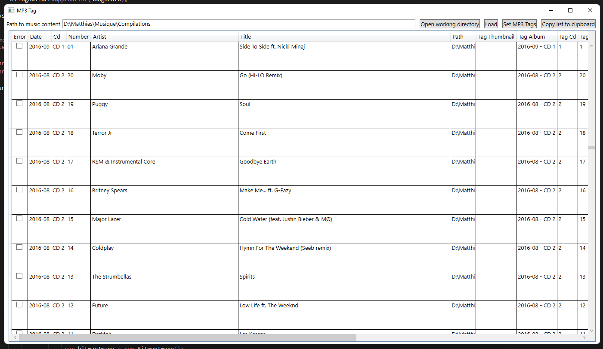

# mp3-tag

mp3-tag is a small WPF application designed to add MP3 tags on your songs based on the folder hierarchy its contains in.

Right now, the path are coded in the following format:

***path***/{ALBUM}/{CD if any, not mandatory}/{TRACKNUMBER} - {ARTIST NAME} - {SONG-NAME}.mp3

This tool will then extract all those metadata from the file path and put them inside the MP3 tag to be read correctly by MP3 player like your car.

WPF UI:
